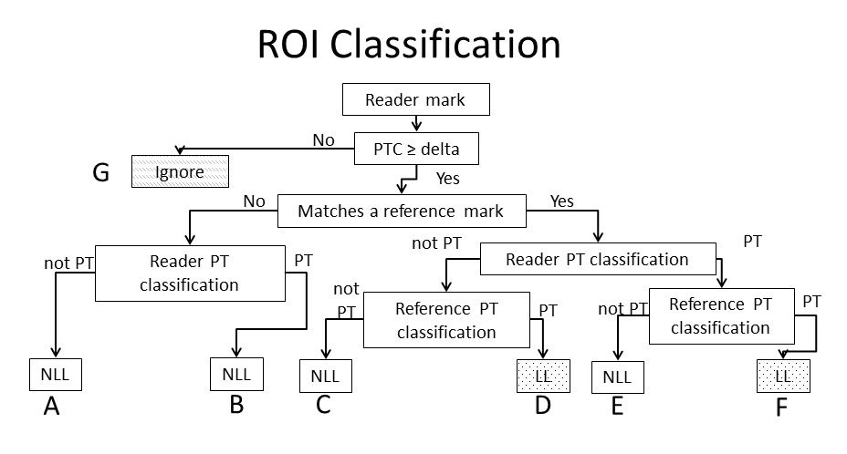

```{r setup, include = FALSE}
knitr::opts_chunk$set(
  collapse = TRUE,
  comment = "#>"
)
```

```{r include=FALSE}
## Load some packages to tidy up the markdown file. This isn't related to the package.
library(knitr)
library(kableExtra)
```

# Introduction to the \code{mrmctools} Package

The package \code{mrmctools} includes a suite of tools to aid in the processing and presentation of Multi-Reader, Multi-Case (MRMC) studies. While the main analysis is performed in the \code{RJafroc} package, there is often significant preprocessing and exploratory analyses that need to be accomplished prior to finalization of analysis. This is where this package comes in. This vignette is a viewed as a working draft of an analysis start to finish. 

## Brief MRMC Study Overview

Briefly, a MRMR is a study design frequently used to evaluate a new imaging strategy's performance at some defined radiologic task. For example, one might be interested in determining how well radiologists read lower dose CT scans while searching for liver cancer (hepatic metastases). A typical study design would be to acquire (or artificially generate) a series of CT scans for a series of patients. Each scan within the series would be at a different dose. The study design is ``fully crossed`` in that each patient has each dose available. The series of images are randomized and radiologists will read all of the images.

``Reading an image`` is written generically for accessibility. What occurs is the readers will review each scan and localize (draw a region of interest, ROI) around suspicious features in the dataset. In our studies, readers will assign a confidence score for a detection (confidence some anonomly is present) and the confidence score that they believe the suspicious region is related to the ``primary task`` (the primary task confidence).  The primary task concept is an important aspect to these studies. The primary task, which is detection of hepatic metastases in this case, could mean that if a reader sees another defect in the case and note it, for example, liver cirrhosis. Should this ROI be counted in the analysis?  This is a difficult question to answer. Part of this package provides a standardized framework to account for and document these decisions in the analysis.

The system we utilize to capture the study data utilizes two files. These are described below. To facilitate exploration of this package, we include data from a recently completed MRMC study to demonstrate the packages functions. 

# Data preparation steps

Our team currently utilizes an in house built reader workstation to record the reader marks.Prepare the workstation files
Two excel or CSV files are needed for the analysis. The first is the anonymization file. 

1.	Anonymization file

This file should contain columns headings for the subject ID number followed by columns of each imaging strategy.  This file is often manually edited so that the imaging strategies have clear labels (these carry forward to all analyses) and unnecessary columns and rows are removed.

2.	Workstation output file

This is the file that contains all of the reader marks matched, when possible, to the reference marks. Generally, no interaction with this file is required as the generic analysis functions first normalize this file’s column headings programmatically. 


The package includes a dataset pairing. The anonymization file is \code{demoanon} and the workstation file is \code{demodata}. The following code sets these package provided datafiles to a local object for the processing.


```{r readdata, message=FALSE, warning=FALSE}
library(mrmctools)
data(demodata)
rawdata_t1 <- demodata
data(demoanon)
rawdeidentify <- demoanon
```

This is a listing of the first few rows in each data file.

Reader markings
```{r echo=FALSE}
kable(head(rawdata_t1))
```

As you can see in the table above, some of the data is customized to an individual survey. There is also a numeric values represented as text columns. The next section will demonstrate the preprocessing steps. 

Anonymization File

```{r echo=FALSE}
kable(head(rawdeidentify))
```

For the anonymization file, you will see a unique subject identifier. The programs that follows will provide a further de-identification of the data.


# Preprocessing and normalization

In the preprocessing process, two main functions will be used: \code{readerworkstationfile} and \code{applyflowchart}.


## readworkstationfile
Run the function \code{readworkstationfile}. The function has parameters that map the workstation variable names to the standardized names. There are also two additional parameters: \code{anonymizereader} and \code{expandcases}. Both of these should generally be true. The reader’s lanids are recorded by the workstation. \code{anonymizereader} replaces these with a randomly assigned integer. \code{expandcases} happens to provide some error control in case there are some missed combinations of readers and lesions (i.e., a lesion that was never identified by any of the readers on any of the imaging strategies). 

```{r}
#use the order in which you want them plotted in this case
# these same labels will be used later for additional plotting purposes
flevels=c("B30_200", "I30_2_160", "B30_120", "I30_2_120", "I30_2_100")
flabels=c("FBP 200 QRM", "IR 160 QRM", "FBP 120 QRM", "IR 120 QRM", "IR 100 QRM")

raw1 <- readworkstationfile(workstationdata=rawdata_t1, 
                  deidentificationdata=rawdeidentify,
                  refname="B30_200",  
                  caseindex="orig_number", 
                  RefID = "REF_SurveyResponseID", 
                  RefDataID = "REF_CaseName",
                  RefDetConf = "REF_DetectionConfidenceLiver_24_",
                  RefCode = "REF_DiagnosisCodeLiver_25_",
                  RefPTC = "REF_LesionMetastasisConfidence_27_",
                  datasetname = "OBS_CaseName",
                  ObserverPTC = "OBS_LesionMetastasisConfidence_27_",
                  ObserverCode = "OBS_DiagnosisCodeLiver_25_",
                  ObserverROIID = "OBS_SurveyResponseID",
                  ReaderFullID = "OBS_UserName",
                  anonymizereader = T, expandcases = T)

```

This is the first few rows of the normalized data file
```{r echo=FALSE}
kable(head(raw1))
```


The \code{applyflowchart} function applies the logic in the following figure. This algorithm bins each of the reader ROIs with the primary task confidence (PTC) threshold >= delta into one of 6 bins (Denoted A-F) to facilitate the free response analysis. Bin G (“ignore”, top) does not apply if delta=0. Selecting the PTC threshold >> 0 will generally affect estimated figures of merit (FOM).



The code below is an example function call. The primary task (PT) code in the workstation is 91 for this study. The vector of codes can be easily expanded as the study dictates. However, for the purpose of JAFROC analyses, a mark is either for the primary task ("true positive") or not ("false positive"). It should be noted that as is indicated in the flowchart, the reader-assigned classification (e.g., code = 91) does not affect the calculation of the FOM. Only by excluding reader ROIs (e.g., excluding bin A) would the FOM be affected.  The non-lesion localization (NLL) and lesion localization (LL) indicate whether the lesion counts against or for the FOM, respectively. Informally, a NLL is a false positive and a LL is a true positive. 

The function call below also uses a PTCthreshold of 1. This cause any reader ROIs with a confidence score of 0 for the primary task to be excluded from all analyses. Undermost circumstances, this confidence limit can be 0 or 1 and the analysis will yield essentially the same result. The reason for this is that non-localizations that have zero confidence will always be lower than lesion localizations with non-zero confidence. If a threshold much greater than 1 is used, the results may change significantly. 

```{r}
raw2 <- applyflowchart(raw1, PTcodes = c("91"), PTCthreshold = 1, includeA=T,includeC=T)
```


A subset of the function's results is in the table below. Note that many new fields have been derived, and there's been additional standardization applied to the file. Some function parameters have been stored in the data to make future processing possible. 

```{r}
kable(head(raw2))
```

## ``plotPTCbins``
A helper function has been created to examine the confidence score usage of the final flow chart data file (raw2 above).  The function will jitter the ROI PTC by bin. The mean and count will be displayed on the figure by default. There is currently only one parameter option for the figure--a descriptive name for the primary task can be supplied. The default simply using the abbreviation PT. 

```{r, fig.width=15, fig.height=20}
plotPTCbins(raw2)
```

## ``figuresave``
A small wrapper function has been created to allow for saving of the figures produced by the package. This was created to provide some uniform scaling of the saved images. It's not essential to use. 

```{r}
#figuresave("PTCbyBins.PNG", plotPTCbins(raw2))
```

# Prepare JAFROC File

The current implementation of the RJafroc package allows for the use of an Excel data file. There are three required sheets: a sheet for the lesion identification (and lesion weights), lesion localizations (TP) and non-localizations (FP). The makeJAFROCfile function takes care of this for you. In addition, the function exports a fourth sheet that contains the linkage of the reference dataset set to the original study ID and the JAFROC de-identified ID. To de-identify the JAFROC file, this fourth sheet may need to be deleted.  


```{r}

jaffile <- "testJAFROC.xlsx"
makeJAFROCfile(flowchartdata=raw2,outputfile=jaffile)
```

TIP: In case there is some debate as to what the minimum confidence score for inclusion in the analysis or whether or not Bins A and C should be included, simply run the ``applyflowchart`` and ``makeJAFROCfile`` functions under various settings. You can specify unique file names for the JAFROC excel file and present the analysis in multiple ways.

## ``plotPTC``
Once the JAFROC file is completed, it can be used to produce an additional confidence score visulization. This figure pools the reader data to show how the confidence varies between lesion localizations and non-lesion localizations.  Normally, one sees clear separation in the score usage. If this is not occurring, the FOMs will be attenuated. This might be an indication the wrong codes were used above when specifying the primary task lesion ID. Or, it could be a hard reading task. 

```{r, , fig.width=15, fig.height=20}
plotPTC(jaffile)
```

Note: based on the binning of the histogram, it may appear that there are confidence scores below the specified threshold.

## Traditional Sensitivity and Specificity Analyses

In general, the derivation of sensitivity and specifity for a free response study is not well defined. We have developed adaptations that allow for the reporting of sensitivity and specificity.

# Patient level Analysis

Sensitivity: At least one lesion localization in a case with at least one target to be detected. The primary task confidence for the reader detection is variable. The denominator is the number of cases with at least one target lesion. 

Specificity: No non-lesion localizations above the threshold in a case that does not have any targets. The denominator is the number of cases without any target lesions. 


These definitions are readily applied by the ``derivesensspec`` function.  There are parameters for the JAFROC file to be used along with the confidence thresholds. The function computes the reader-specific performance along with pooled (GEE) estimates. Below is an example of function in use. The resulting dataframe is frequently saved to an Excel format using the writeXLS function. 

```{r}
specex<-derivesensspec("testJAFROC.xlsx",sensitivitythreshold=10, specificitythreshold=10)
kable(specex)
```

TIP: It has been noted that this function uses thresholds differently than the applyflowchart function (>= vs. >). This may change in future releases. For now, note how the function writes out the logic rule to the datatable. You may adjust the threshold selection as needed.


# Lesion Level Analyses

(Lesion) Sensitivity: Lesion detected with confidence above the threshold. The denominator is the number of target lesions in the study.

Specificity: Not applicable


To support additional examination of the lesion detection data and the impact of the threshold selection, additional plotting functions are available. 


The ``plotthreshold_reader`` function can plot, by default, the GEE estimates by modality. Or, one can specify an individual reader number to see how an individual reader performances across modalities. 

```{r, fig.width=15, fig.height=20}
plotthreshold_reader("testJAFROC.xlsx")
```

If you desire to relabel / reorder the modality names, a call such as this can be considered. For this example, reader 1 data is selected. Note, the function calls the ``derivelesionsensitivty`` function above. This function formats the reader ID as a text field with a leading zero to ensure ordering of tables. As a result, reader "1" needs to be entered as readerid="01". 

```{r, fig.width=15, fig.height=20}

plotthreshold_reader("testJAFROC.xlsx", readerid="01", addFactor=T, flevels=flevels, flabels =flabels)
```


A second plot function looks at reader performance for a particular modality. The ``plotthreshold_modality`` function will plot all readers along with an optional GEE line. There are some parameter options that will allow changing of line colors if desired.  This example requests the study's routine clinical dose. The GEE estimate is included by default.

Both threshold plots allow for a logical parameter ``getminmax`` that will search the TP ratings and determine the minimum of the maximum ratings for each reader. This is to mitigate cases where some, or all readers, do not detect at least one lesion with confidence of 100. This can introduce an all zeros condition and cause a function error. If an error is reported, try setting getminmax = F. This will censor the figure at the min-max for the readers. The figure below shows this behavior. 

```{r}
plotthreshold_modality(jafrocfile="testJAFROC.xlsx", modality="B30_200", modalitylabel="FBP 200 QRM",getminmax = T)
```


A final set of functions for lesion-level analyses exists to derive some of the summaries used for the two-stage analyses there were conducted. The first concept is look at is the set of essential lesions. An essential lesion is a  lesions that was detected by the majority of readers at the routine dose.  The function requires the specification of the routine dose along with an export file to store the list in. You can save the resulting data frame for working in memory too.

```{r}
el<-essentiallesions("testJAFROC.xlsx", "B30_200","essentiallesions.xlsx")

kable(head(el,n=20))
```

For a slightly more general look at the detections, the ``derivedections`` function can be used. This function utilizes the primary JAFROC file without any additional specification of a threshold (i.e., reader ROIs that are above the PTC threshold for the study).  The resulting data frame has the reference lesion ID along with the number of detections by modality.  

```{r}
detections <- derivedetections("testJAFROC.xlsx")


kable(head(detections, n=20))
```

# Conducting the JAFROC Analysis

The analysis requires the ``RJafroc`` package.   The logic and use of that package is left to that package's maintainer. In this section, a few additional plotting and results summaries are highlighted.  There are opportunities to do JAFROC and JAFROC1 FOMs. The difference is the "1" version includes non-localization in cases with target lesions in the calculation of the FOMs; otherwise they are excluded. The ``makeJAFROCfile``  also creates the default weights such that each lesion is weighted based on the number in the case. For example, if a case has two lesions, the weights for each lesion is 1/2. Different weights can be assigned but sometimes the justification is hard to describe. 

The RJafroc package has a way to save a text file out with the classically formatted JAFROC results format. This functionality is not shown in this program. 
